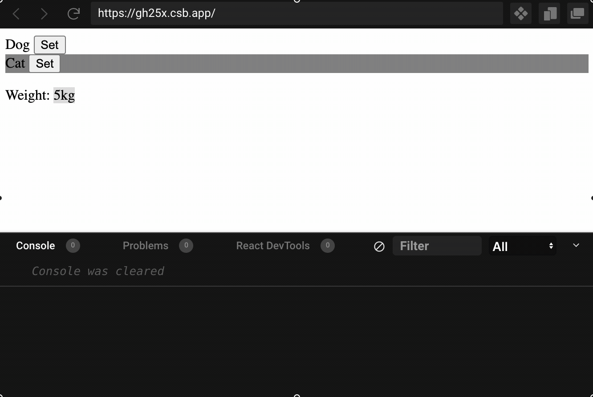

# Tips to avoid pitfalls when using useEffect in React

`useEffect` is the most widely used hook in React. It is handy and looks easy to use, but you must experience infinite loops or some unexpected result when using `useEffect`. In this article, I try to give you some tips to avoid those typical pitfalls when using it.

## Tip #1 understand the mind concept of `useEffect`

The definition of `useEffect` is below:

```typescript
function useEffect(effect: EffectCallback, deps?: DependencyList): void
type EffectCallback = () => void | (() => void | undefined)
type DependencyList = any[]
```

There are three factors in `useEffect`, `effect`, `cleanup`, and `deps`.
The key point is `effect`. We all know `useEffect` is to wrap `side effects` something like `data fetching`, `DOM operations`, etc. To be honest, when I read this at very first time, I didn’t quite understand, util I realised that action wrapped by `useEffect` actually will be executed after the normal render process. It is more like the below:

```typescript
function MyComponent() {
  useEffect(effect, deps)
  /* The above line useEffect will be translated into the below:
  new Promise( (resolve) => {
    effect()
    resolve()
  })
 */
  return <div>My awesome component</div>
}
```

Another factor is `cleanup` , and it will be called once the component umount from the DOM tree, something like when we close a tab or when we redirect to another page. `cleanup` is like below:

```typescript
function MyComponent() {
  useEffect(effect, deps)
  /* when umount from the DOM tree, will run:
  const cleanup = effect()
  cleanup()
  */
  return <div>My awesome component</div>
}
```

`deps` is a simple plain list. React will record the valuation of what it ran last time. And it will compare each item in the list to the previous list when re-render happens. If there are the same, the re-render process will skip `effect`, otherwise it will execute `effect` again. `deps` looks quite easy, but it is the most error-prone part in `useEffect`, and the most issues come from this.

## Tip #2 Pay extra attention to the object or function items in dependency list

Most `useEffect` issues come from `deps`, and let’s take a close look at `deps`.
As we already know, `deps` is just an array with many items of any types. And when determining if the `effect` need to be executed, it compare each item with strict equality manner (triple equals). So the determination process is more like below:

```typescript
function shouldSkipEffect (previousDeps: any [], currentDeps: any []) {
  for (let i = 0; i < previousDeps.length; i ++) {
    if (previousDeps[i] !== currentDeps[i)]) {
      return false
    }
  }
  return true
}
```

Please pay attention to the strict equality `===`. It is quite straight forward for most primitive types like `number`, `string`, `boolean`, `null`, or `undefined`. However, for object or function, it will compare the address. Even the object values are exactly the same, but we create an object using `literal way`, it will be treated as different. So when `object` or `function` appears in the `deps`, pay extra attention.
The following is a very obvious infinite loop error:

```typescript
function App() {
  const [person, setPerson] = useState({ name: "ron" })
  useEffect(() => {
    document.title = person.name
    setPerson({ name: "ron" }) // Though it set the person object using the same value, but it is a different object which will cause rerender and runing the effect again and again
  }, [person])
  return (
    <div className="App">
      <h1>Hello CodeSandbox</h1>
      <h2>Start editing to see some magic happen!</h2>
    </div>
  )
}
```

Maybe you think you will not do the above fault. But when nesting components and pass callbacks along the way, it is easy to make such mistakes.

## Tip #3 Make the function less dynamic

Function is the 1st citizen in Javascript, so it can be created dynamically. If we create a function in functional component, and was used in `effect`, it means it will trigger the `effect` every time the component is re-rendered. The following is an example that the `sendMessage` function will be created in every render process.

```typescript
function App() {
  const sendMessage = () => {}
}
```

If we need this function in certain effect and of course we need to put it in effect dependency list, it will potentially cause extra effect execution issue. The reason behind is if the effect is triggered by other factor cause re-render and the `sendMessage` function will be changed which trigger the effect execution again. It might not be a big issue, unless it will be a problem if sending message twice.

The following is the whole code to simulate the issue, or can visit [code sandbox](https://codesandbox.io/s/fix-useeffect-by-less-dynamic-func-gh25x).

Basically, there is an `Animals` component, which present the animals, and will tell the parent the animal weight and also need to send a message with the weight.

```typescript
import * as React from "react"
import "./styles.css"

type Animal = "cat" | "dog"
const weight: { [key: string]: number } = { cat: 5, dog: 7 }
const Animals: React.FC<{
  sendMessage: (x: Animal) => void
  setWeight: (n: number) => void
}> = ({ sendMessage, setWeight }) => {
  const [selectedAnimal, setSelectedAnimal] = React.useState<Animal>("cat")

  React.useEffect(() => {
    setWeight(weight[selectedAnimal])
    sendMessage(selectedAnimal)
  }, [sendMessage, selectedAnimal, setWeight])

  return (
    <>
      <div style={selectedAnimal === "dog" ? { backgroundColor: "grey" } : {}}>
        Dog <button onClick={() => setSelectedAnimal("dog")}>Set</button>
      </div>
      <div style={selectedAnimal === "cat" ? { backgroundColor: "grey" } : {}}>
        Cat <button onClick={() => setSelectedAnimal("cat")}>Set</button>
      </div>
    </>
  )
}

export default function App() {
  const [weight, setWeight] = React.useState<number>()
  const sendMessage = (animal: Animal) => console.log(`Show ${animal}`)
  return (
    <>
      <Animals setWeight={setWeight} sendMessage={sendMessage} />
      <p>Weight: {weight}kg</p>
    </>
  )
}
```

Check this  for the problem. Did you see the console.log twice for each message?

The root cause is the effect of the `Animals` component, it will trigger the parent `App` component to re-render, because the `sendMessage` function defined in `App` component, it will change each time when `App` re render, which trigger the execution of the effect `Animals` component again.

So, how to fix this issue? The answer is to make the `sendMessage` function less dynamic, there are two ways to make the less dynamic:

- Move `sendMessage` function out of the component like below:

  ```typescript
  const sendMessage = (animal: Animal) => console.log(`Show ${animal}`)
  export default function App() {
    // ...
  }
  ```

- Use `useCallback` function to make it static like below:

  ```typescript
  export default function App() {
    const sendMessage = useCallback(
      () => (animal: Animal) => console.log(`Show ${animal}`),
      []
    )
    // ...
  }
  ```

## Tip #4 Make the object less dynamic

If an object appears in the dependency list of the effect, we need to pay attention esp. when this object is varying.

The below is a example that a varying object in dependency list cause the `sendMessage` fired twice, or you can visit [code sandbox](https://codesandbox.io/s/fix-useeffect-by-less-dynamic-obj-0ehei).

This time it is not because of the dynamic function, it is because of the varying object.

The root cause is the effect of the `Animals` component, it will trigger the parent `App` component to re-render, because the `animals` object defined `literal way`, it will change each time when `App` re render, which trigger the execution of the effect `Animals` component again.

```typescript
import * as React from "react"
import "./styles.css"

type AnimalsConfig = { [key: string]: number }
const Animals: React.FC<{
  setWeight: (n: number) => void
  animals: AnimalsConfig
  sendMessage: (m: string) => void
}> = ({ setWeight, animals, sendMessage }) => {
  const [selectedAnimal, setSelectedAnimal] = React.useState<string>()

  React.useEffect(() => {
    if (selectedAnimal) {
      sendMessage(selectedAnimal)
      setWeight(animals[selectedAnimal])
    }
  }, [selectedAnimal, setWeight, animals, sendMessage])

  return (
    <>
      <div style={selectedAnimal === "dog" ? { backgroundColor: "grey" } : {}}>
        Dog <button onClick={() => setSelectedAnimal("dog")}>Set</button>
      </div>
      <div style={selectedAnimal === "cat" ? { backgroundColor: "grey" } : {}}>
        Cat <button onClick={() => setSelectedAnimal("cat")}>Set</button>
      </div>
    </>
  )
}

export default function App() {
  const [weight, setWeight] = React.useState<number>()
  const sendMessage = React.useCallback(
    (animal: string) => console.log(`show ${animal}`),
    []
  )
  return (
    <>
      <Animals
        setWeight={setWeight}
        animals={{ cat: 5, dog: 7 }}
        sendMessage={sendMessage}
      />
      <p>Weight: {weight}kg</p>
    </>
  )
}
```

To fix the issue, there are several ways as below:

- Move the `animals` definition static, i.e., put it outside.

```typescript
const animals = { cat: 5, dog: 7 }
export default function App() {
  // ...
  return (
    <>
      <Animals
        setWeight={setWeight}
        animals={animals}
        sendMessage={sendMessage}
      />
      <p>Weight: {weight}kg</p>
    </>
  )
}
```

- Introduce customised `useDeepMemo`, which will create a memo based on if the object value changes.

```typescript
const Animals: React.FC<{
  setWeight: (n: number) => void
  animals: AnimalsConfig
  sendMessage: (m: string) => void
}> = ({ setWeight, animals: originalAnimals, sendMessage }) => {
  const animals = useDeepMemo(() => originalAnimals, originalAnimals)
  // ...
}
```

And the `useDeepMemo` is below:

```typescript
/* The below code is inspired by apollo graphql, 
check: https://github.com/apollographql/apollo-client/blob/main/src/react/hooks/utils/useDeepMemo.ts
*/
import { useRef } from "react"
import { equal } from "@wry/equality"

/**
 * Memoize a result using deep equality. This hook has two advantages over
 * React.useMemo: it uses deep equality to compare memo keys, and it guarantees
 * that the memo function will only be called if the keys are unequal.
 * React.useMemo cannot be relied on to do this, since it is only a performance
 * optimization (see https://reactjs.org/docs/hooks-reference.html#usememo).
 */
function useDeepMemo<TKey, TValue>(memoFn: () => TValue, key: TKey): TValue {
  const ref = useRef<{ key: TKey; value: TValue }>()

  if (!ref.current || !equal(key, ref.current.key)) {
    ref.current = { key, value: memoFn() }
  }

  return ref.current.value
}

export { useDeepMemo }
```

Or please check the [code sandbox](https://codesandbox.io/s/fix-useeffect-by-less-dynamic-obj-solution2-hiw6q) for all the source code.
