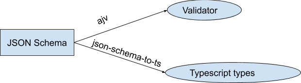

---
title: Extend typescript to runtime - Part 2 using json schema 
date: "2020-12-28"
description: typescript types will be wiped when compiling, but how to use these types in runtime?
--- 
## Problem

In the last article, I discussed to use `runtypes` to connect static types and runtime check.
The theory behind is `runtypes` has its own definition language, which can convert to a runtime check function and a static typescript type.
By doing that we can remove the duplication across the two world.

It is awesome, however one of the biggest cons of this approach is: `runtypes` defined a good definition language but it is not well known.
Because of that, it is less possible to create a strong ecosystem for different scenarios.

For example, recently I am working on a REST API project, and we are using open api to create the interactive document. However, we have to write typescript types for those request and response, which is annoying and very easy to make a mistake. I am imagining that we could have some tool can generate those typescript types based on the open api document, just like what `graphql-codegen` is doing for the GraphQL schema.

Because open api standard depends on JSON Schema, a well known standard. If we can connect static types and runtime check based on JSON Schema, I believe a lot of problem will be solved.

## Another solution

And it is possible!

Let's take a look the sample JSON Schema file named `person.json`:

```json
{
  "title": "Person",
  "type": "object",
  "properties": {
    "firstName": {
      "type": "string"
    },
    "lastName": {
      "type": "string"
    },
    "age": {
      "description": "Age in years",
      "type": "integer",
      "minimum": 0
    },
    "hairColor": {
      "enum": ["black", "brown", "blue"],
      "type": "string"
    }
  },
  "additionalProperties": false,
  "required": ["firstName", "lastName"]
}
```

Everybody might know there are many JSON Schema validators already existed, like: [ajv](https://github.com/ajv-validator/ajv), which can validate the passing data by given the JSON Schema. 
Let's give the above example to validate object:

```typescript
import Ajv, { JSONSchemaType, DefinedError } from "ajv";
const validateObj = (obj: unknown) => {
  const ajv = new Ajv();
  const validate = ajv.compile({
    title: "Example Schema",
    type: "object",
    properties: {
      firstName: {
        type: "string"
      },
      lastName: {
        type: "string"
      },
      age: {
        description: "Age in years",
        type: "integer",
        minimum: 0
      },
      hairColor: {
        enum: ["black", "brown", "blue"],
        type: "string"
      }
    },
    additionalProperties: false,
    required: ["firstName", "lastName"]
  });
  if (validate(obj)) {
    // data is MyData here
    console.log("It is a valid obj: ", JSON.stringify(obj));
  } else {
    console.log("It is not a valid obj: ", JSON.stringify(obj));
    for (const err of validate.errors as DefinedError[]) {
      console.log(err);
    }
  }
};

validateObj({});
validateObj({
  firstName: "luke",
  lastName: "skywalker",
  age: 16,
  hairColor: "black"
});
```

And the output is below:

```english
It is not a valid obj:  {} 
{keyword: "required", dataPath: "", schemaPath: "#/required", params: Object, message: "should have required property 'firstName'"}
It is a valid obj:  {"firstName":"luke","lastName":"skywalker","age":16,"hairColor":"black"} 
```

And there is another tool called [json-schema-to-typescript](https://github.com/bcherny/json-schema-to-typescript), which can generate typescript based on the JSON Schema.

For example, given the above JSON Schema, and run the following command:

```bash
yarn add json-schema-to-typescript
json2ts person.json > person.d.ts
```

It will generate the following typescript file:

```typescript
export interface Person {
  firstName: string;
  lastName: string;
  /**
   * Age in years
   */
  age?: number;
  hairColor?: "black" | "brown" | "blue";
}
```

## Sum up

In this article, we use another approach to connect realtime check and static typescript type by using more standard JSON Schema.
Check the following digram for more details:

