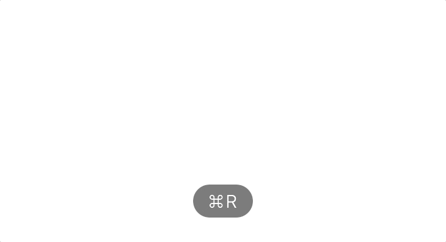

Graphql is cool, it exposes the exact contract between frontend and backend in details.

However, when you try to use it, there is still gaps between graphql and the host programming language. For example, mostly frontend project is using typescript, while graphql is strong typed contract but still not typescript.

This situation is like when we develop SQL based application by using Java. At that time, we have ORM, stands for Object Oriented Mapping, which is a standard tool mapping object structure and sql relationship, and allow developer to access SQL database by knowing only JAVA or other object oriented languages. Do we have similar tool to map between Graphql and typescript or other languages?

The answer is yes, it is [`graphql-codegen`](https://graphql-code-generator.com/). (Although there are other tools for this goal, but `graphql-codegen` is definitely the most flexible and advanced one.

In this article, I am going to tell you what is `graphql-codegen`, and how to use `graphql-codegen` to generate typescript types and react graphql query/mutation hooks by using a example.

## What is `graphql-codegen`

In `graphql-codegen` home page, it describe it as below:

> Generate code from your GraphQL schema and operations with a simple CLI

This short sentence tells us:

- It is a command line. In more details, tt is a command line with a `yaml` configuration file.

- It generate code from graphql. It does generate code and not limited to certain language, currently it supports typescript, flow, Reason, Java, .Net, etc. And it is extensible via plugins. If you have special requirement, potentially, you can write a new plugin yourself.

## Rock it

I am going to develop a react app to list star wars characters by using [this star wars graphql server](https://graphql.org/swapi-graphql/). Let's get hands dirty.

### Step 1: Initialise

Create a new react typescript app by using create-react-app

```bash
npx create-react-app star-wars-app --template typescript
cd start-wars-app
```

### Step 2: Install apollo client

Let's use the most popular graphql client: apollo client.

```bash
yarn add @apollo/client graphql -S
```

### Step 3: Install graphql-codegen tool

Install the following `graphql-codegen` packages.

- @graphql-codegen/cli: core command line file

- @graphql-codegen/typescript: plugin to generate typescript types

- @graphql-codegen/typescript-react-apollo: plugin to generate react related types, mainly for hooks

- @graphql-codegen/typescript-operations: plugin to generate hooks for operations sit in different files

- @graphql-codegen/fragment-matcher: plugin to generate the fragment matcher files to server fragment union, we need this if we want to use fragment union, will give more information later

```bash
yarn add @graphql-codegen/cli \
@graphql-codegen/typescript \
@graphql-codegen/fragment-matcher \
@graphql-codegen/typescript-operations \
@graphql-codegen/typescript-react-apollo  -D
```

### Step 4: Config graphql-codegen

`graphql-codegen` tool has only one configuration file, it is using yaml format, and it tells graphql-code what plugins to use and their configurations.

Create a file called `graphql-codegen.yml` under project root path, and type the following content:

```yaml
schema: "https://swapi-graphql.netlify.app/.netlify/functions/index"
overwrite: true
documents: src/**/*.graphql
generates:
  src/generated/graphql-types.tsx:
    plugins:
      - "typescript"
      - "typescript-operations"
      - "typescript-react-apollo"
```

To simplify, let's create a scripts in `package.json` like below:

```json
{
  "scripts": {
    "graphql:codegen": "graphql-codegen --config graphql-codegen.yml"
  }
}
```

### Step 5: Execute the codegen tool

Create a query file called `getAllPeople.graphql` under `/src/graphql`, and type the following content. This script accept the pageSize and request the allPeople query.

```graphql
query GetAllPeople($pageSize: Int) {
  allPeople(first: $pageSize) {
    people {
      name
      birthYear
      gender
      height
    }
  }
}}
```

Run the script:

```bash
yarn graphql:codegen
```

If everything goes all right, you should be able to see the `graphql-types.tsx` file is already generated under `src/generated` folder. And if you check the file you will see, all the graphql schemas are written in typescript.

### Step 6: Complete the react code

index.tsx: create an apollo client and wrap the App into ApolloProvider

```typescript
import { ApolloClient, ApolloProvider, InMemoryCache } from "@apollo/client"
import React from "react"
import ReactDOM from "react-dom"
import App from "./App"

const client = new ApolloClient({
  uri: "https://swapi-graphql.netlify.app/.netlify/functions/index",
  cache: new InMemoryCache(),
})
ReactDOM.render(
  <React.StrictMode>
    <ApolloProvider client={client}>
      <App />
    </ApolloProvider>
  </React.StrictMode>,
  document.getElementById("root")
)
```

App.tsx:

```typescript
import React from "react"
import { useGetAllPeopleQuery } from "./generated/graphql-types"

function App() {
  const { loading, data, error } = useGetAllPeopleQuery({
    variables: { pageSize: 5 },
  })
  if (loading || error || !data) {
    return <div>Loading...</div>
  }
  return (
    <>
      <h1>Star wars characters</h1>
      {data?.allPeople?.people?.map(p => (
        <div>
          {p?.name}: {p?.gender}, {p?.height}cm, born in {p?.birthYear}
        </div>
      ))}
    </>
  )
}

export default App
```

In the above code, useGetAllPeopleQuery is the hook generated by the graphql codegen.

The returned data is all typed, check the below screen record:


### Step 7: Sit back and enjoy

That's it, all done. Run the following command to check your result

```bash
yarn start
```



## Sum up

In the article, we demoed the frontend process with graphql. With the `graphql-codegen` tool, we filled the gap between graphql and typescript.

The above source code can be found in [this github repo](https://github.com/ron-liu/how-to-generate-typescript-types-for-graphql-in-react) .

I did enjoy the whole process. How about you?

The last thing I need to mention is it is a relative simple demo, if you need more support like `fragment union`, you need to config more settings in `graphql-codegen.yml` file. And the best ways to learn those settings are checking [the office site](https://graphql-code-generator.com/docs/getting-started/index) and getting your hands dirty.
